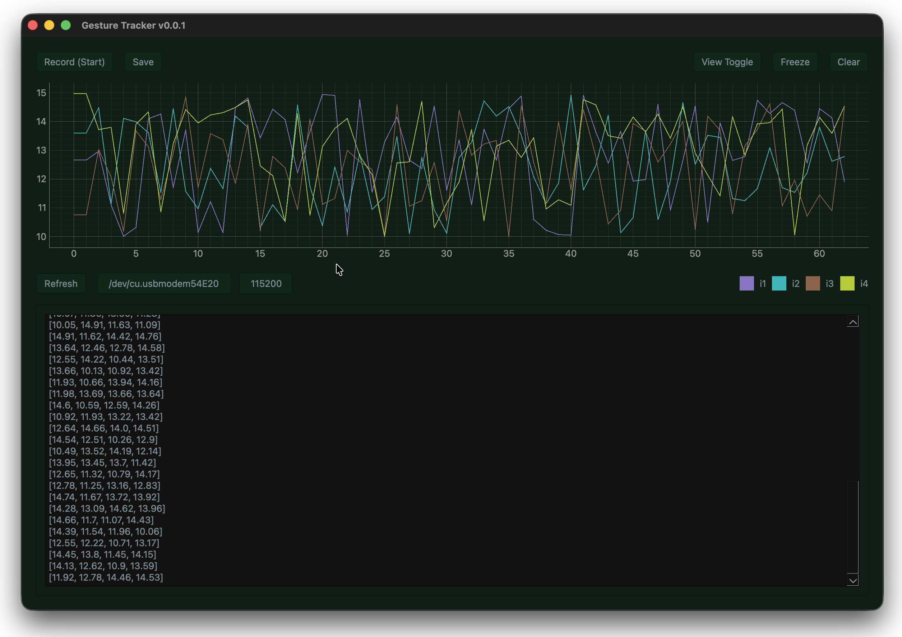

# CaptureSRM (WIP)

Application designed to expand OpenNetics capabilities. A user-friendly interface for reading and
analysing serial data, this tool helps create `.srm` files, holding machine learning models
for raw sensor readings; used for gesture and pattern recognition.

### Key Features

- **Real-Time Data Monitoring:** Connect to OpenNetics device and view live sensor data. The application
  plots the data on a graph, while simultaneously displaying the raw readings on the screen.
- **Data Exporting:** Save read data to a `.txt` file for future analysis or backup purposes.
- **Pattern Recording:** Capture and repeat a flow of sensor readings. This feature allows for the
  collection of consistent data samples, and generating models based on the pattern observed.
- **Machine Learning Integration:** Transform recorded sensor readings into a standardised `.srm` file
  that can be utilised in various programming projects. This simplifies the process of
  implementing pattern recognition in server applications.

### Contributing

Contributions are welcome! Feel free to submit issues or pull requests to enhance the functionality
of the program.

